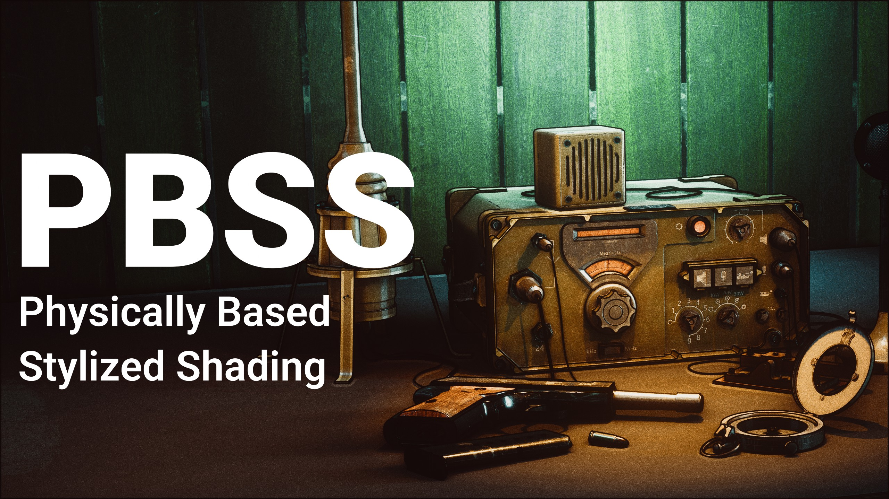
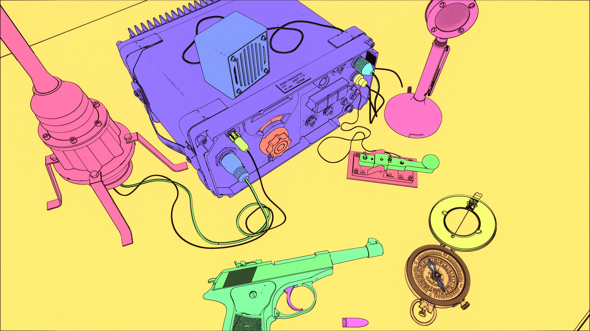
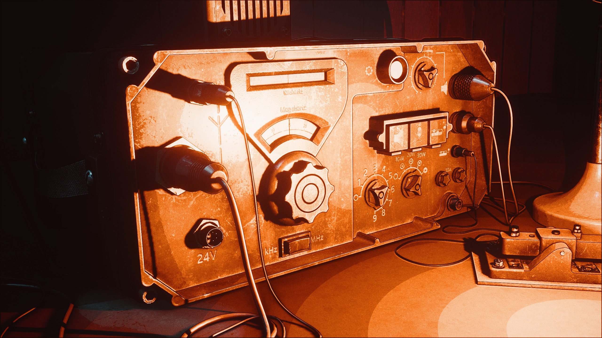

# PBSS

Physically based stylized shader for Blender 5.1+. In its very early days. There is some truth behind it, but the name doesnt particularly makes sense, but it sounds good and at the end of the day thats good marketing.

## Compatibility
Blender 5.1+ Only. Eevee is fully suported and recommended. Cycles support is limited. Not required but [Pixel Manager](https://github.com/Joegenco/PixelManager) OCIO config is highly recommended.

## Features
- Uses blender shaders and lighting, meaning no need to use a custom light rig, or workaround shading, light as you would traditionally. PBSS is also (can be) energy conserving which means appending it on a existing scene should cause nothing to change energy wise, making it easy to retroactivly switch a existing scene to PBSS without needing lighting tweaks.

- Robust outline and Rimlight rendering using Raycasting method (inspired by Miguel Pozo)

- Unbound Quantized lighting via quantizing exposure bands, allows more perceptually linear bands of light, as well as letting effects like bloom and usage of tonemappers more viable

- Manually enable or disable every rendering feature, or bypass certain ones for full creative control
- Much more!

## Help contribute
Via suggesting fixes, improvements, new features, or take your hand at adding new features and contributing yourself. Always open for collaboration
